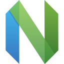

  <h1>👋 Hi, I'm Sebastian Andres El Khoury Seoane</h1>
  <h3>Full-Stack Web Developer | Cloud Infrastructure and DevOps Engineer | CS @ University of St Andrews</h3>
  
  

    <strong>🎓</strong> Computer Science Student (Penultimate Year) | <strong>GPA:</strong> 3.6/4.0 
    <strong>🏆</strong> Dean's List (2024-2025) | International Foundation Programme High-Merit (2023-2024) 
    <strong>📍</strong> St Andrews, Scotland | <strong>🌍</strong> Remote-Ready
  

---

## 🚀 About Me

I'm a full-stack web developer passionate about building scalable, cloud-native applications. With hands-on experience in modern web technologies, containerization, and CI/CD pipelines, I specialize in:

- **Backend Development** with Node.js, TypeScript, and Express/Fastify
- **Frontend Development** with React and Next.js, styled with TailwindCSS
- **Database Design** with PostgreSQL and MongoDB
- **Cloud Infrastructure** using Docker, Kubernetes, and GCP
- **DevOps & Reliability** practices with CI/CD automation

---

## 💬 Ask Me About

<table>
  <tr>
    <td><strong>Specialization</strong></td>
    <td>Full-Stack Web Development, DevOps, Site Reliability Engineering.</td>
  </tr>
  <tr>
    <td><strong>Languages</strong></td>
    <td>TypeScript, JavaScript, Python, Java, C++, Rust.</td>
  </tr>
  <tr>
    <td><strong>Frameworks & Tools</strong></td>
    <td>React, Next.js, Express, Fastify, Flask, Django, Node.js, PostgreSQL, Docker, Kubernetes.</td>
  </tr>
</table>

---

## 🔗 Connect With Me

  
  
  

---

## 🛠️ Core Tech Stack

### **📝 Languages & Runtimes**

  
  
  
  
  
  
  
  

### **🎨 Frontend & UI**

  
  
  
  
  

### **⚙️ Backend & APIs**

  
  
  
  

### **🗄️ Databases**

  
  
  

### **☁️ DevOps & Infrastructure**

  
  
  
  
  
  

### **📊 Data Science & Analysis**

  
  
  
  

### **🛠️ Developer Tools**

  
  
  
  

---

## 📊 GitHub Analytics

  
### Contribution Activity

### Contribution Streak

---

## 📞 Let's Connect

  

    <strong>💌 Email:</strong> <a href="mailto:sebasandres0694@gmail.com">sebasandres0694@gmail.com</a> 
    <strong>🔗 LinkedIn:</strong> <a href="https://www.linkedin.com/in/sebastian-el-khoury-seoane-234791303/">sebastian-el-khoury-seoane</a> 
    <strong>💻 GitHub:</strong> <a href="https://github.com/s-andres0694">@s-andres0694</a>
  

