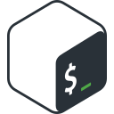
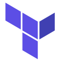
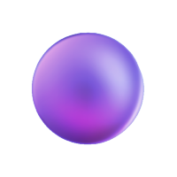
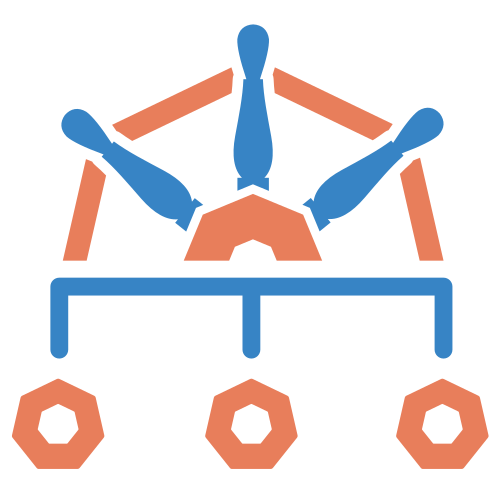
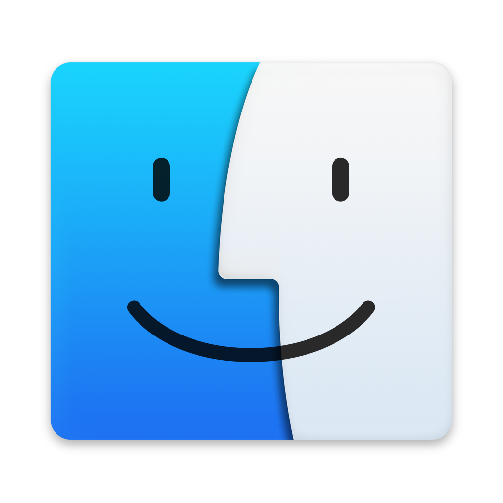
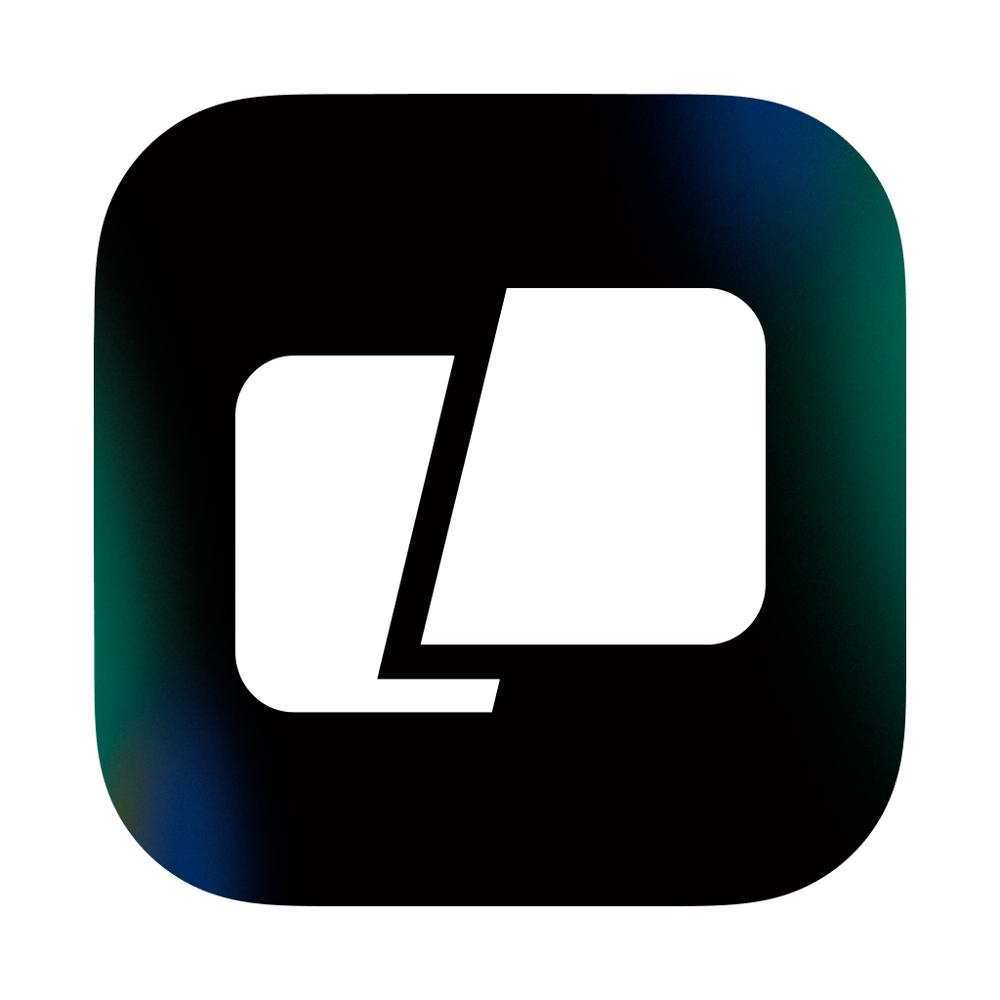
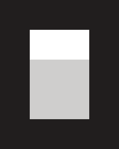

  <h1>👋 Hi, I'm Sebastian Andres El Khoury Seoane</h1>
  <h3>Platform Engineer | Cloud Infrastructure & DevOps | SRE | CS @ University of St Andrews</h3>
  
  

    <strong>🎓</strong> Computer Science Student (Final Year) 
    <strong>🏆</strong> Dean's List (2024-2025) | International Foundation Programme High-Merit (2023-2024) 
    <strong>📍</strong> St Andrews, Scotland | <strong>🌍</strong> Open to Relocation & Remote 
  

---

## 🚀 About Me

Final-year CS student with hands-on platform engineering experience in multi-region AWS EKS environments, Helm-based platform development, and infrastructure automation via Terraform and ArgoCD. Also experienced in open-source engineering for AI Platforms.

Seeking graduate roles in **Platform Engineering, DevOps, SRE, or Cloud Infrastructure**.

**Key strengths:**
- **Platform Engineering** — Kubernetes, AWS, Terraform, Docker, Helm, multi-tenant infrastructure
- **Cloud Infrastructure** — AWS (EKS, IAM, S3, Route 53), GCP, Terraform, HCP Terraform
- **Observability & Monitoring** — Grafana, Prometheus, OpenTelemetry, Jaeger
- **CI/CD & GitOps** — GitHub Actions, ArgoCD, Azure DevOps, Kyverno policy management
- **Backend Development** — TypeScript, Python, Java, Node.js, REST APIs

---

## 💬 Ask Me About

<table>
  <tr>
    <td><strong>Specialization</strong></td>
    <td>Platform Engineering, DevOps, Site Reliability Engineering, Cloud Infrastructure.</td>
  </tr>
  <tr>
    <td><strong>Core Stack</strong></td>
    <td>Kubernetes, AWS, Terraform, Docker, Python, Helm, Grafana, TypeScript, Java.</td>
  </tr>
  <tr>
    <td><strong>Tools & Practices</strong></td>
    <td>ArgoCD, Kyverno, Linux, Bash, GitHub Actions, GCP, Prometheus, OpenTelemetry, Azure DevOps.</td>
  </tr>
</table>

---

## 🔗 Connect With Me

  
  
  

---

## 🛠️ Core Tech Stack

### **📝 Languages & Runtimes**

  
  
  
  
  
  
  
  
  

### **☁️ Cloud & Infrastructure**

  
  
  
  
  
  
  
  
  

### **🔄 CI/CD & GitOps**

  
  
  
  

### **📊 Monitoring & Observability**

  
  
  
  

### **🎨 Frontend & UI**

  
  
  
  
  

### **⚙️ Backend & APIs**

  
  
  
  

### **🗄️ Databases**

  
  
  

### **📊 Data Science & Analysis**

  
  
  
  

### **🛠️ Developer Tools**

  
  
  
  
  
  
  
  

---

## 📊 GitHub Analytics

  
### Contribution Activity

### Contribution Streak

---

## 📞 Let's Connect

  

    <strong>💌 Email:</strong> <a href="mailto:sebasandres0694@gmail.com">sebasandres0694@gmail.com</a> 
    <strong>🔗 LinkedIn:</strong> <a href="https://www.linkedin.com/in/sebastian-el-khoury-seoane-234791303/">sebastian-el-khoury-seoane</a> 
    <strong>💻 GitHub:</strong> <a href="https://github.com/s-andres0694">@s-andres0694</a>
  

